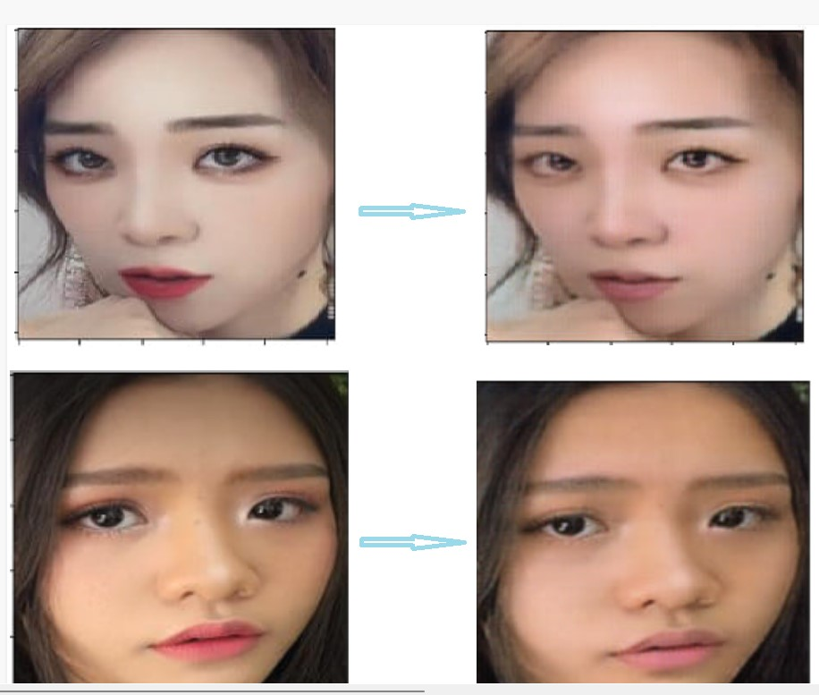

# How to run server
gunicorn --workers 4 --bind 0.0.0.0:5000 wsgi:app

# frontend
Camera capture app (android)
# Getting Started:
- install expo-cli
- install dependencies in package.json
# How to run
expo start

# Results

	

